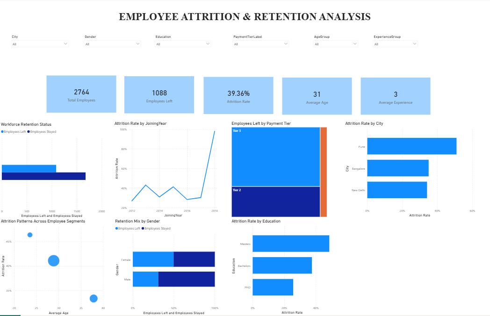
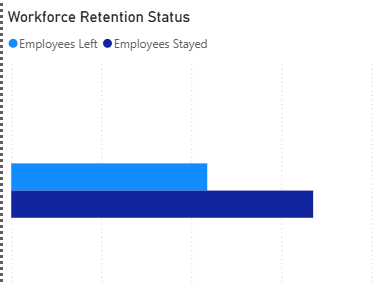
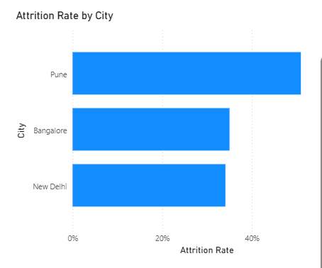
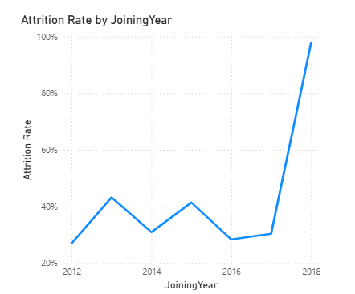
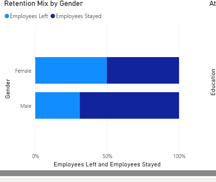
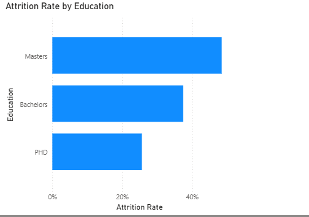

# Employee Attrition & Retention Analysis

## Project Overview

Employee turnover can create significant costs for organizations through recruitment, onboarding, lost productivity, and replacement of experienced employees.

This project analyzes employee data to identify patterns associated with employee attrition and retention. The analysis focuses on workforce characteristics such as city, payment tier, education, gender, age, experience, bench status, and joining year.

The project combines **SQL for data cleaning and analysis** with **Power BI for dashboard development and data visualization**.

The goal is to transform raw employee records into actionable insights that can help HR and management identify employee segments with comparatively higher observed attrition and determine where further investigation may be valuable.

---

## Business Objective

The main objectives of this analysis were to:

* Measure the overall employee attrition rate.
* Understand the proportion of employees who stayed versus those who left.
* Identify employee segments with higher observed attrition rates.
* Compare attrition patterns across cities and payment tiers.
* Examine how attrition varies by education and gender.
* Analyze the relationship between age and observed attrition.
* Examine attrition patterns across experience groups.
* Analyze attrition trends based on employee joining year.
* Present the findings through an interactive Power BI dashboard.

---

## Dataset

The dataset contains employee-level records with information including:

* Education
* Joining Year
* City
* Payment Tier
* Age
* Gender
* Bench Status
* Experience in Current Domain
* Leave/Attrition Status

The original dataset contained **4,653 records**.

Because the dataset did not contain a unique employee identifier, duplicate handling was based on identifying **exact duplicate records across the available fields**.

After removing exact duplicate records, the analytical dataset contained:

**2,764 unique records**

---

## Tools & Technologies

| Tool     | Purpose                                          |
| -------- | ------------------------------------------------ |
| MySQL    | Data cleaning, transformation and analysis       |
| Power BI | Data visualization and dashboard development     |

---

# Data Cleaning & Preparation

The raw employee data was cleaned and transformed in MySQL before being imported into Power BI.

A separate analytical table called `employee_clean` was created while preserving the original `employee` table.

### Main cleaning steps

1. Removed exact duplicate records.
2. Standardized the bench status into a numerical field.
3. Created a business-friendly attrition status.
4. Created age groups.
5. Created experience groups.
6. Created payment tier labels.
7. Validated the resulting dataset.
8. Confirmed the final record count before analysis.

### Analytical Dataset

The final analytical table contains:

* `Education`
* `JoiningYear`
* `City`
* `PaymentTier`
* `Age`
* `Gender`
* `EverBenched`
* `ExperienceInCurrentDomain`
* `LeaveOrNot`
* `AttritionStatus`
* `AgeGroup`
* `ExperienceGroup`
* `PaymentTierLabel`
---

# Key Performance Indicators

The analysis produced the following workforce-level metrics:

| KPI                |     Result |
| ------------------ | ---------: |
| Total Employees    |      2,764 |
| Employees Left     |      1,088 |
| Employees Stayed   |      1,676 |
| Attrition Rate     |     39.36% |
| Average Age        |      31 |
| Average Experience | 3 years |
| Bench Rate         |     13.06% |

Overall, **1,088 of the 2,764 employees in the cleaned dataset were recorded as having left**, resulting in an observed attrition rate of **39.36%**.

---

# Key Findings

## 1. Attrition by City

| City      | Employees | Employees Left | Attrition Rate |
| --------- | --------: | -------------: | -------------: |
| Pune      |       801 |            408 |     **50.94%** |
| Bangalore |     1,171 |            410 |         35.01% |
| New Delhi |       792 |            270 |         34.09% |

Pune recorded the highest observed attrition rate at **50.94%**, substantially higher than Bangalore and New Delhi.

This makes Pune an important segment for further investigation into factors such as working conditions, compensation, management practices, workload, or employee experience.

---

## 2. Attrition by Payment Tier

| Payment Tier | Employees | Employees Left | Attrition Rate |
| ------------ | --------: | -------------: | -------------: |
| Tier 2       |       570 |            343 |     **60.18%** |
| Tier 1       |       218 |             77 |         35.32% |
| Tier 3       |     1,976 |            668 |         33.81% |

Tier 2 recorded the highest observed attrition rate at **60.18%**.

This is the highest attrition rate among the analyzed employee segments and may warrant further investigation into the characteristics and employment conditions associated with Tier 2 employees.

---

## 3. Attrition by Education

| Education  | Employees | Employees Left | Attrition Rate |
| ---------- | --------: | -------------: | -------------: |
| Master's   |       637 |            309 |     **48.51%** |
| Bachelor's |     1,971 |            739 |         37.49% |
| PHD        |       156 |             40 |         25.64% |

Employees with a Master's qualification recorded the highest observed attrition rate at **48.51%**.

This finding should be investigated alongside other workforce characteristics rather than interpreted as evidence that education level itself causes attrition.

---

## 4. Attrition by Gender

| Gender | Employees | Employees Left | Attrition Rate |
| ------ | --------: | -------------: | -------------: |
| Female |     1,235 |            614 |     **49.72%** |
| Male   |     1,529 |            474 |         31.00% |

Female employees recorded a higher observed attrition rate than male employees in this dataset.

This difference may warrant further analysis of factors such as job roles, location, compensation, career progression, and employee experience.

---

## 5. Attrition by Age Group

| Age Group | Employees | Employees Left | Attrition Rate |
| --------- | --------: | -------------: | -------------: |
| Under 25  |       233 |            108 |     **46.35%** |
| 25-34     |     1,755 |            721 |         41.08% |
| 35-44     |       776 |            259 |         33.38% |

The youngest employee group recorded a relatively high observed attrition rate.

Attrition generally declined across the age groups represented in the dataset, with employees aged 35–44 showing the lowest observed rate among the available groups.

---

## 6. Attrition by Experience

| Experience Group | Employees | Employees Left | Attrition Rate |
| ---------------- | --------: | -------------: | -------------: |
| 0 Years          |       287 |            109 |         37.98% |
| 1-2 Years        |     1,114 |            451 |         40.48% |
| 3-4 Years        |       876 |            363 |     **41.44%** |
| 5+ Years         |       487 |            165 |         33.88% |

Employees with **3–4 years of experience** recorded the highest observed attrition rate at **41.44%**.

The 5+ years group had the lowest observed attrition rate at **33.88%**.

---

## 7. Attrition by Bench Status

Employees who had previously been benched recorded an observed attrition rate of **44.04%**, compared with **38.66%** among employees who had not been benched.

This difference suggests that bench experience may be worth investigating as one of several potential factors associated with employee retention.

---

# Highest Observed Attrition Segments

The analysis identified the following segments with comparatively high observed attrition:

| Segment              | Highest Observed Attrition |
| -------------------- | -------------------------: |
| Tier 2               |                 **60.18%** |
| Pune                 |                 **50.94%** |
| Female               |                 **49.72%** |
| Master's             |                 **48.51%** |
| Under 25             |                 **46.35%** |
| 3–4 Years Experience |                 **41.44%** |

These segments should not automatically be interpreted as "high-risk employees."

The results identify **observed associations within this dataset**, which can help guide further HR investigation.

---

# Power BI Dashboard

The Power BI dashboard brings the analysis together into an interactive executive view.

### Dashboard Objectives

The dashboard was designed to allow users to:

* Monitor overall workforce attrition.
* Compare employees who stayed versus those who left.
* Identify locations with higher observed attrition.
* Monitor attrition patterns over joining years.
* Compare workforce retention across gender.
* Examine age and experience segments.
* Filter the analysis using interactive slicers.

---

## Dashboard Overview

---

## Workforce Retention Status

This visualization shows the overall proportion of employees who stayed compared with those who left.

---

## Attrition by City

This visualization compares observed attrition rates across the three cities represented in the dataset.

---

## Attrition Trend by Joining Year

The dashboard also examines how employee attrition varies according to joining year.

---

## Retention Mix by Gender

This visualization compares the proportion of employees who stayed and left across gender groups.

---

## Attrition by Education Level

This visualization shows attrition rate across the three levels of education.

---

# Dashboard Interactivity

The Power BI dashboard includes slicers that allow users to explore the data dynamically.

Available filters include:

* City
* Education
* Gender
* Payment Tier
* Age Group
* Experience Group

Selecting a filter updates the relevant KPIs and visualizations, allowing users to investigate specific workforce segments.

---

# Business Insights

The analysis highlights several areas that management or HR teams could investigate further.

### 1. Investigate Tier 2 attrition

Tier 2 employees recorded the highest observed attrition rate at **60.18%**.

Further investigation could examine whether compensation, job roles, location, career progression, or workload differs significantly within this segment.

### 2. Investigate Pune's attrition pattern

Pune recorded an observed attrition rate of **50.94%**, considerably higher than Bangalore and New Delhi.

HR teams could investigate whether there are location-specific factors contributing to this difference.

### 3. Examine early and mid-career retention

Employees under 25 recorded an observed attrition rate of **46.35%**, while employees with 3–4 years of experience recorded **41.44%**.

Retention initiatives could therefore examine career development, progression opportunities, mentorship, and employee engagement during these stages.

### 4. Investigate gender differences

Female employees recorded an observed attrition rate of **49.72%**, compared with **31.00%** for male employees.

This difference warrants deeper analysis of the underlying employee characteristics before drawing conclusions.

### 5. Examine the relationship between bench status and retention

Employees who had been benched recorded a **44.04%** observed attrition rate compared with **38.66%** for employees who had not been benched.

Further analysis could investigate whether bench duration, frequency, or role availability is associated with employee retention.

---

# Recommendations

Based on the observed patterns, organizations could consider:

### Targeted retention analysis

Prioritize deeper investigation of employee segments with higher observed attrition rather than applying the same retention strategy across the entire workforce.

### Location-specific investigation

Examine workforce conditions in Pune to understand why its observed attrition rate is higher than the other locations.

### Payment-tier review

Investigate the characteristics of Tier 2 employees, including compensation, roles, career progression, and workload.

### Career development initiatives

Explore mentorship, training, career progression, and internal mobility opportunities for younger and mid-career employees.

### Employee experience analysis

Conduct additional analysis using variables such as job role, salary, manager, workload, tenure, satisfaction, and performance if these data become available.

### Data-driven retention monitoring

Use recurring HR dashboards to monitor attrition trends and identify changes in employee retention over time.

---

# Limitations

This analysis has several limitations:

* The dataset does not contain a unique employee ID.
* Duplicate removal was therefore based on exact matching across available fields.
* The dataset does not establish why employees left.
* Observed relationships should not be interpreted as causal relationships.
* Important HR variables such as salary, job role, manager, satisfaction, workload, and promotion history were not available.
* Joining year should not be interpreted as employee tenure without considering the analysis period and available context.

These limitations should be considered when interpreting the results.

---

# Key Takeaway

The cleaned dataset contains **2,764 employee records**, with an observed attrition rate of **39.36%**.

The strongest observed attrition patterns were associated with:

* **Tier 2 employees — 60.18%**
* **Pune employees — 50.94%**
* **Female employees — 49.72%**
* **Master's-educated employees — 48.51%**
* **Employees under 25 — 46.35%**
* **Employees with 3–4 years of experience — 41.44%**

These findings provide a starting point for targeted HR investigation and demonstrate how SQL and Power BI can be used to transform employee data into actionable business insights.
